##Reveal Markdown / GH-Pages
Makes creating presentations feel, more like programming.  Uses Github-pages to share presentation content and provides proper version control.

-----------

###Quick Start
0. Visit: https://github.com/aln787/revealMD-simpleStarter
0. Fork the project
 - 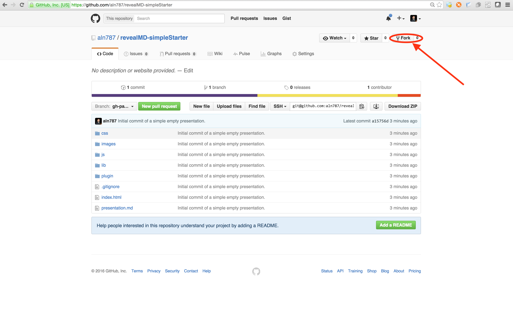
0. Select your-self as the fork location
 - 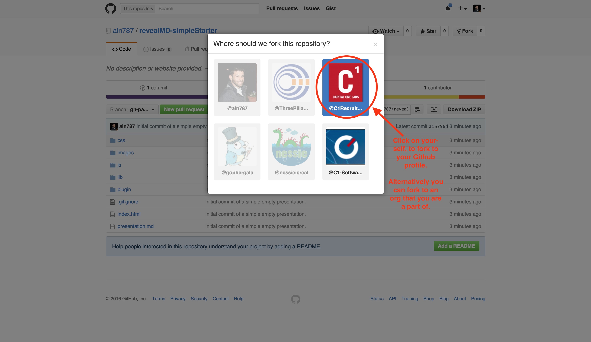
0. Update the index.html in your fork of the project
 - 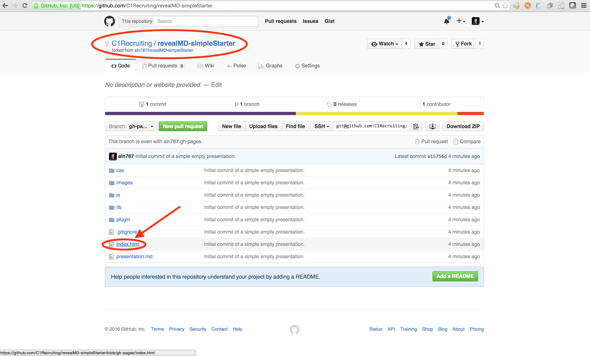
0. Edit the index file
 - 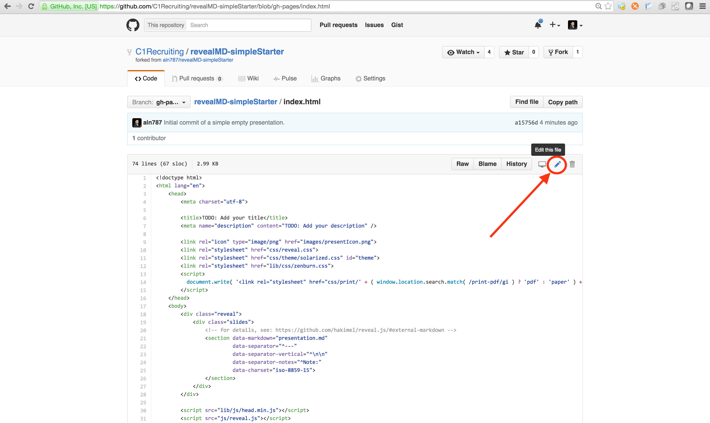
0. Replace all `TODO:`'s with your content
 - 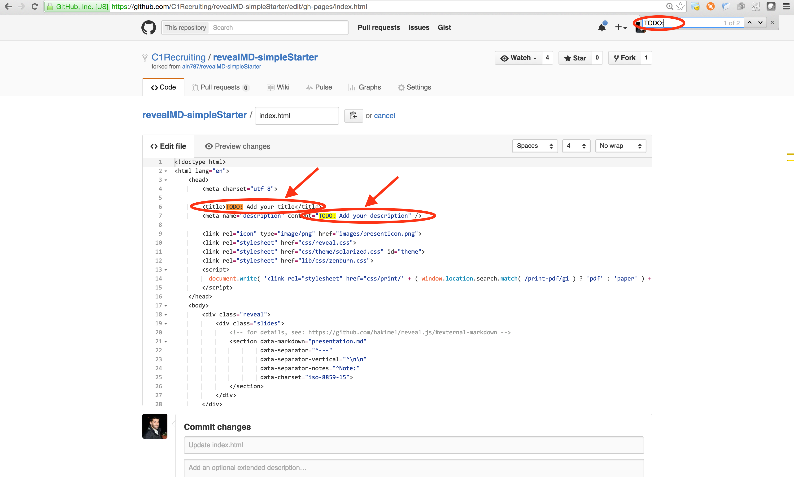
0. Add a note about what you changed and click `Commit Changes`
 - 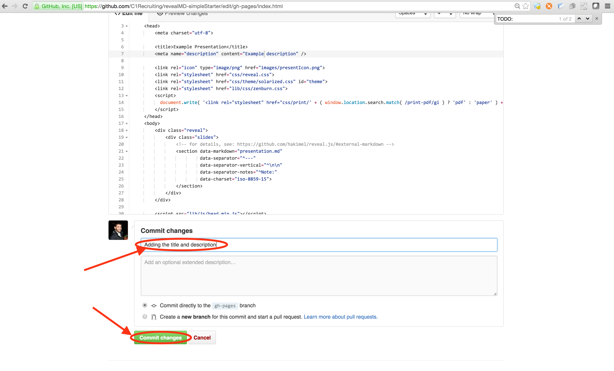
0. Now open `presentation.md`
 - 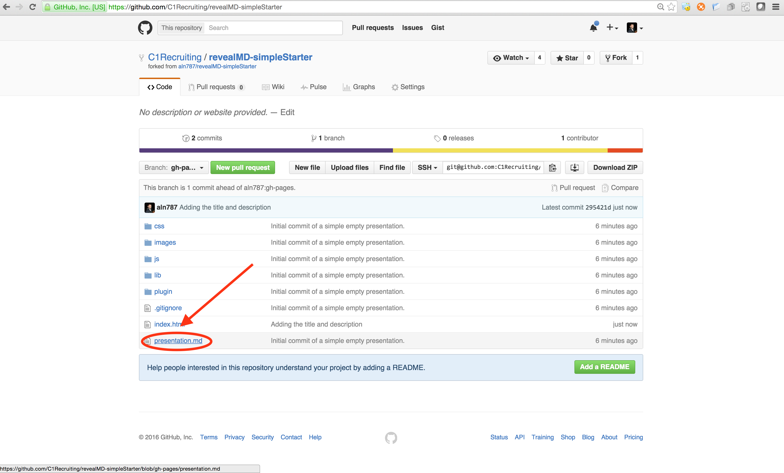
0. Click edit
 - 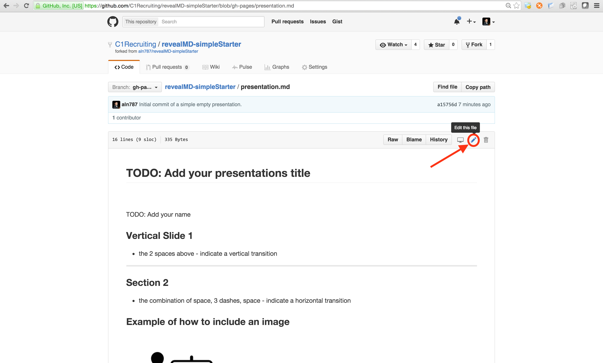
0. Replace all `TODO:`'s with your content; add a note about what you changed and click `Commit Changes`
 - 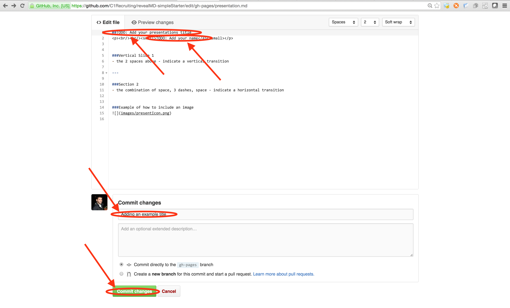
0. Open settings for your forked repo
 - 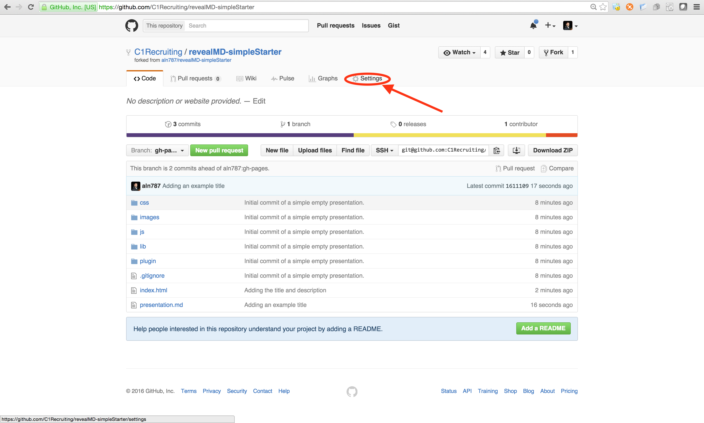
0. Click on your Github pages link
 - 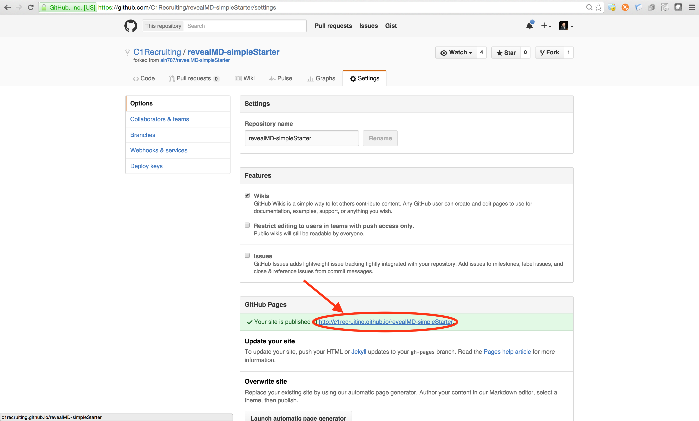
0. Your changes will appear in the browser
 - 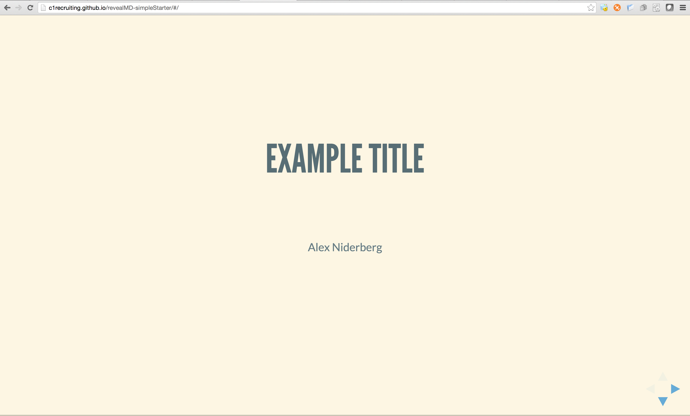
0. Hit `esc` to see an overview of the entire presentation
 - 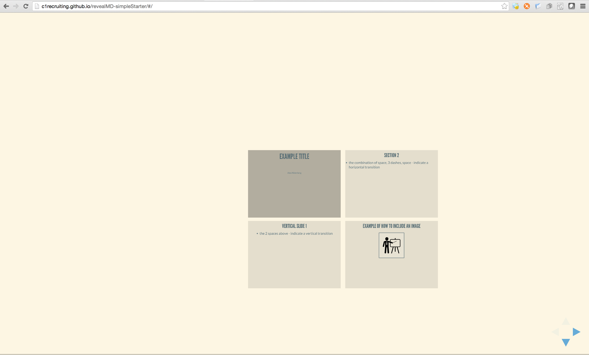
0. Head back to your fork of the presentation, you are now ready add the rest of the content to your presentation
0. Optionally clone your presentation and follow the instructions below so you can view your presentation locally

----------

###View Locally


####Install HTTP Server
```
#Install NPM
curl https://npmjs.org/install.sh | sh
#If you already have NPM
npm install http-server -g
```

####Serve Content
```
http-server -p 8082
```